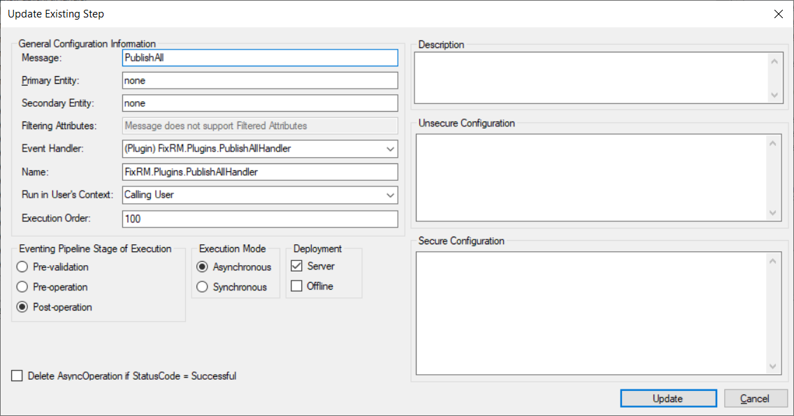
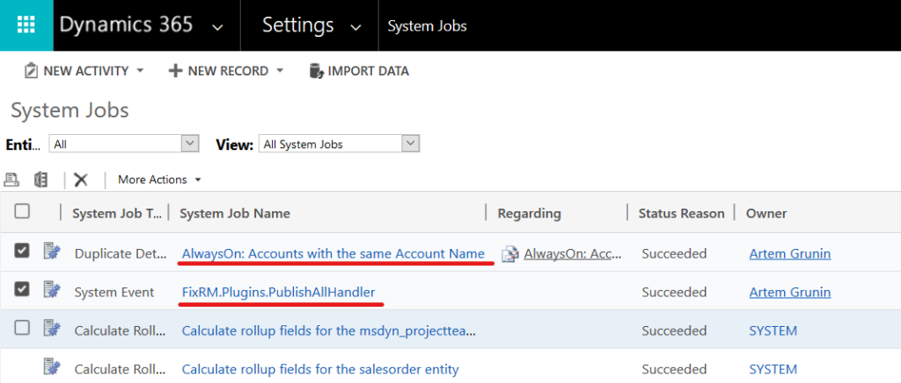

# Duplicate Detection Always On
D365 solution and plugin to publish duplicate detection rules automatically. For more info please refer the blog post: [How to keep Duplicate detection rules always on](https://fixrm.wordpress.com/2019/05/17/how-to-keep-duplicate-detection-rules-always-on/)

## Installation
Please download latest version from [release page](/../../releases).

Two options available: 
1. Managed solution
2. Plugin assembly

To use first option please import solution file as usual. Solution was build on D365 Online v9 so may not be compatible with OnPrem or earlier versions of the system. If you unable to install solution, please use second option instead.

To manually deploy plugin assembly you'll need a tool like [Plugin Registration Tool](https://www.nuget.org/packages/Microsoft.CrmSdk.XrmTooling.PluginRegistrationTool) or [XrmToolBox version](https://www.xrmtoolbox.com/plugins/Xrm.Sdk.PluginRegistration/) which is better option on my taste.

Register new assembly using a tool of your choice and then create a new step as shown below:

You can also enable "Delete AsyncOperation..." option if you want.

## Usage
Add "AlwaysOn" (no space) in the beginning of name to any rule you want to be published automatically. For example:
> AlwaysOn: Accounts with the same Account Name
	
Publish all customizations. Rules what have "AlwaysOn" prefix will be published automatically.
> **!!! Always check rule publication statuses to avoid problems. Sometimes rules are broken and need to be fixed and published manually !!!**

To do that navigate to Settings => Data Management => Duplicate Detection Rules or to Settings => System Job sections:

## Enjoy!